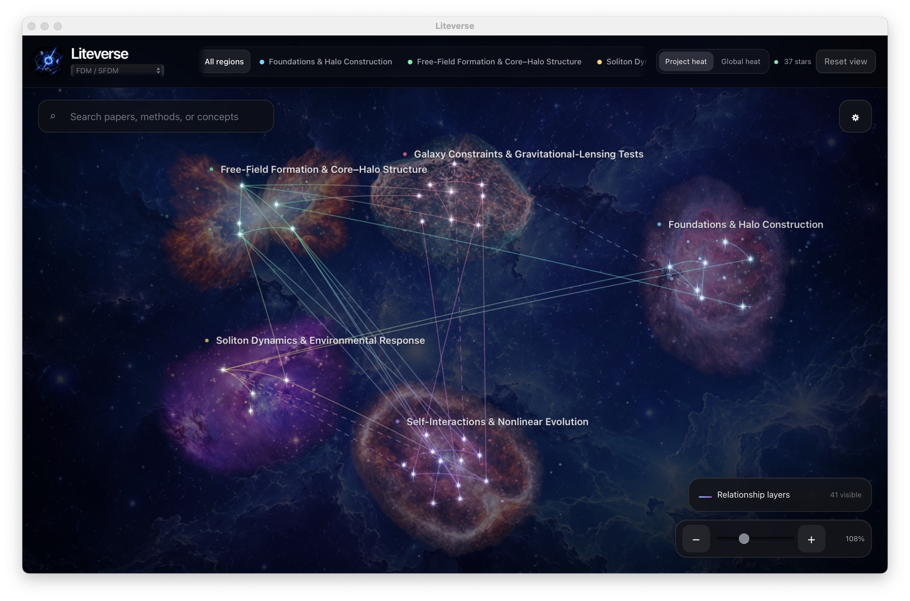

<p align="center">
  
</p>

<h1 align="center">Liteverse</h1>

<p align="center">
  <strong>A local-first literature universe for researchers and AI.</strong>
</p>

<p align="center">
  <a href="https://github.com/1003560213-hub/Liteverse/releases">Download</a>
  ·
  <a href="#quick-start">Quick start</a>
  ·
  <a href="CONTRIBUTING.md">Contribute</a>
</p>

Liteverse turns a literature library into an interactive research universe.
Papers become stars, broad themes become nebulae, and meaningful relationships
become visible links. The same local library can give an AI assistant focused,
traceable context without uploading the whole research workspace to a cloud
service.



<p align="center">
  <sub>
    An example from the creator's theoretical-physics research library. Public
    downloads start with an empty universe and include no personal papers or
    project data.
  </sub>
</p>

## What Liteverse does

- Organizes papers into a movable 3D literature universe with up to ten broad
  research regions.
- Opens paper summaries, evidence, relationships, and personal annotations.
- Accepts local PDFs and arXiv links while keeping the managed library local.
- Searches verified literature and builds focused context for AI-assisted work.
- Preserves project goals, decisions, code and experiment metadata, findings,
  and open questions.
- Makes frequently used research areas visually brighter without changing
  scientific evidence or relationship scores.

## Quick start

1. Download the current Developer Preview from
   [GitHub Releases](https://github.com/1003560213-hub/Liteverse/releases).
2. Unzip the macOS arm64 archive and move **Liteverse.app** to Applications.
3. On first launch, Control-click the app and choose **Open**.
4. Open **Settings → Literature** and add either a PDF or an arXiv link.
5. Liteverse prepares the source locally. Ask Codex to review its scientific
   meaning, then choose **Refresh** when the updated universe is ready.

The current preview requires **macOS 13 or later** on an **Apple Silicon Mac**.
It is ad-hoc signed and has not yet been notarized by Apple.

## Use Liteverse with Codex

Codex is optional, installed separately, and is never launched automatically.
Liteverse includes three installable Skills:

| Skill | Purpose |
| --- | --- |
| `liteverse-curator` | Organizes new papers, knowledge cards, regions, relationships, and annotations. |
| `liteverse-retriever` | Finds and adopts verified literature evidence for a task. |
| `liteverse-research-memory` | Preserves project decisions, code, experiments, results, and handoffs. |

Install the bundled integration with:

```bash
"/Applications/Liteverse.app/Contents/Resources/install-codex-skills.sh"
```

Then use natural language in Codex:

> Use the Liteverse library to compare these papers and prepare context for this
> simulation task.

Liteverse gives Codex a focused, versioned Context Pack instead of placing an
entire library into one prompt. AI inferences remain provisional unless they
are supported by exact paper evidence or reproducible computation records.

## Local-first by design

Liteverse stores its mutable workspace under:

```text
~/Library/Application Support/Liteverse/
```

The public app starts empty and contains no personal papers, annotations, graph
data, or research memory. Version 0.4.0 has no account, cloud sync, background
daemon, bundled language model, or default cloud embedding. Its short-lived
native Worker handles hashing, explicit arXiv retrieval, PDF extraction,
deduplication, and routing-only review packets, then exits. Processing an arXiv
link may use the network only to retrieve the source explicitly requested by
the user.

Liteverse can be used as a visual library without AI. Codex remains responsible
for scientific interpretation, evidence-aware relationships, verified
classification, and semantic research-memory updates.

## Development

Source builds require macOS 13+, Node.js 24+, and Python 3.12+.

```bash
python3 -m pip install --requirement requirements.txt
npm ci
npm run dev
```

Run `npm test` for the full public-source validation suite. Packaging and
release requirements are documented in [RELEASING.md](RELEASING.md).

## Contributing and security

Contributions are welcome. Read [CONTRIBUTING.md](CONTRIBUTING.md) before
opening a pull request. Report security issues through the private process in
[SECURITY.md](SECURITY.md), not through a public issue.

## License

Liteverse is available under the [MIT License](LICENSE). Artwork attribution and
licensing details are listed in [ASSET_LICENSES.md](ASSET_LICENSES.md).
