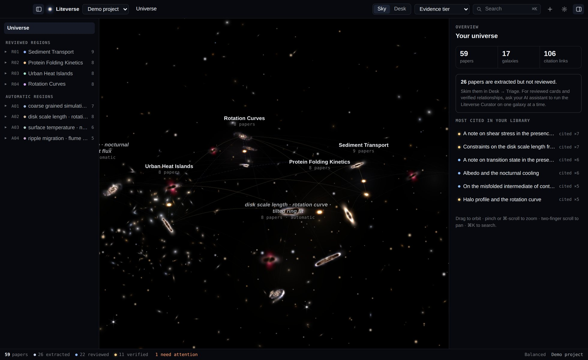
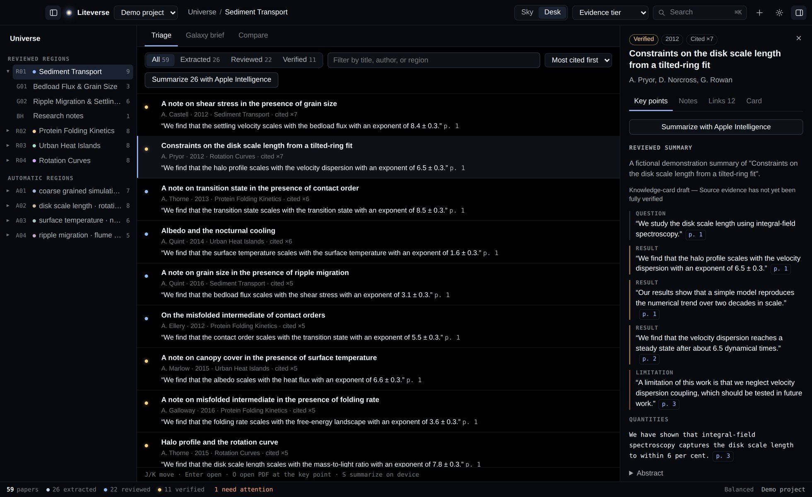
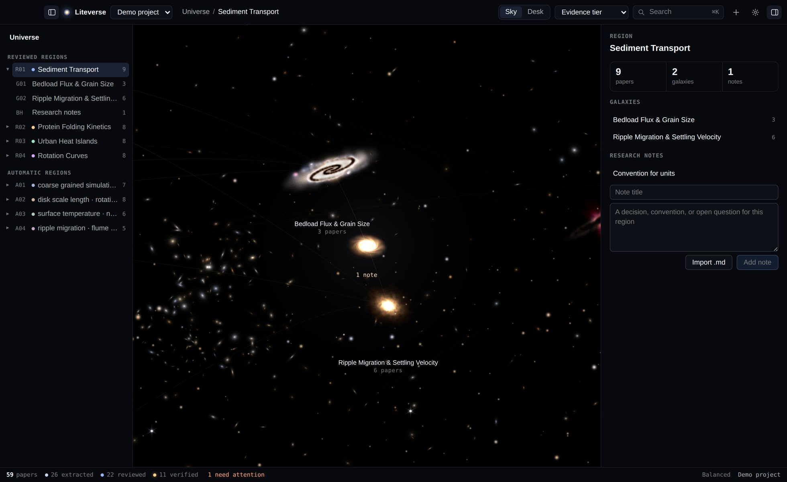

<p align="center">
  
</p>

<h1 align="center">Liteverse</h1>

<p align="center">
  <strong>A local-first literature universe for researchers and AI.</strong>
</p>

<p align="center">
  <a href="https://github.com/1003560213-hub/Liteverse/releases">Download</a>
  ·
  <a href="#quick-start">Quick start</a>
  ·
  <a href="CONTRIBUTING.md">Contribute</a>
</p>

Liteverse turns a folder of PDFs into a connected, readable map of your field.
It reads every paper on your Mac, pulls out the key sentences with page
references, links papers that cite each other, and arranges them as a 3D deep
field: broad themes become galaxy clusters, focused topics become galaxies,
and papers become stars.



<p align="center">
  <sub>
    A fictional demonstration library. Public downloads start with an empty
    universe and contain no papers or project data.
  </sub>
</p>

## Read a large library quickly



- **Key points in seconds, without AI.** Each paper gets its abstract, up to
  eight verbatim key sentences (question, method, result, limitation,
  assumption), quantities, and a parsed reference list. Every point links to its
  page, and nothing is paraphrased or invented.
- **Connections from citations.** Reference lists are matched to the papers you
  already have, so you see who cites whom, the sentence where it happens, which
  papers are foundational in your library, and a reading path through each
  topic.
- **Automatic organization.** Papers are grouped by shared references and
  vocabulary into clusters and galaxies before any AI review.
- **Desk mode for fast reading:** keyboard triage (J/K, Enter, O to open the PDF
  at the quote), a galaxy brief, and a side-by-side comparison table.
- **Optional Apple Intelligence summaries** on macOS 26, generated on your Mac
  from the extracted key points and always labelled as drafts.
- **Honest evidence tiers:** *Extracted* (local, verbatim), *Reviewed* (AI-curated
  card drafts), and *Verified* (checked against the original pages). A tier is
  never silently promoted.

## A real deep universe, built for laptops



- Galaxies are real 3D point clouds generated in Blender from physically
  motivated models (exponential discs, Sérsic bulges, logarithmic spiral arms,
  dust lanes, star-forming knots) and drawn with WebGL.
- Research notes live in the accretion disc of each cluster's central black
  hole.
- The universe draws only when something changes. On battery, in Low Power Mode,
  or when the Mac is hot, it switches to a power-saving quality automatically.
- Trackpad-native: pinch to zoom, scroll to pan, drag to orbit. Standard Mac
  menus and shortcuts (⌘K search, ⌘1/⌘2 Sky/Desk, ⌘[ back).

## Quick start

1. Download the current Developer Preview from
   [GitHub Releases](https://github.com/1003560213-hub/Liteverse/releases).
2. Unzip the macOS arm64 archive and move **Liteverse.app** to Applications.
3. On first launch, Control-click the app and choose **Open**.
4. Press **⌘O** to import PDFs, or open **Settings → Library** to add an arXiv
   link, link a folder, or connect Zotero.
5. Watch the universe fill in. Use **Desk** (⌘2) to skim, and ask an AI
   assistant to review one galaxy at a time when you want reviewed cards and
   verified relationships.

Requires **macOS 13 or later** on an **Apple Silicon Mac**. Apple Intelligence
summaries need macOS 26 with Apple Intelligence turned on. The preview is
ad-hoc signed and has not been notarized by Apple.

## Use Liteverse with an AI assistant

Liteverse includes three installable Skills for Codex and other agents that
can run the command-line interface:

| Skill | Purpose |
| --- | --- |
| `liteverse-curator` | Reviews papers by galaxy, builds knowledge cards, regions, relationships, and annotations. |
| `liteverse-retriever` | Finds and adopts verified literature evidence for a task. |
| `liteverse-research-memory` | Preserves project decisions, code, experiments, results, and handoffs. |

```bash
"/Applications/Liteverse.app/Contents/Resources/install-codex-skills.sh"
```

Useful commands:

```bash
liteverse tier0 build                  # refresh extracted key points and citation links
liteverse digest packet --galaxy <id>  # one galaxy, ready for AI review
liteverse context build --project <id> --query "..."
```

AI output is accepted only when it cites the extracted quotations, and
relationships stay candidates until they are checked against the original
pages.

## Local-first by design

Your workspace lives in `~/Library/Application Support/Liteverse/`. The public
app starts empty. There is no account, cloud sync, background daemon, or bundled
language model. Extraction, citation matching, clustering, and search run on
your Mac. An arXiv link downloads only that paper and its official metadata.
Apple Intelligence summaries use Apple's on-device model and never leave your
Mac. Linked folders and Zotero attachments stay where they are.

## Development

Source builds require macOS 13+, Node.js 24+, and Python 3.12+. Packaging the
Apple Intelligence helper requires Xcode 26 (the rest builds with older SDKs).

```bash
python3 -m pip install --requirement requirements.txt
npm ci
npm run dev        # browser preview with a fictional demonstration library
npm test
npm run desktop:package
```

The galaxy assets are generated with Blender; see
[tools/blender/README.md](tools/blender/README.md). Release steps are in
[RELEASING.md](RELEASING.md).

## Contributing and security

Contributions are welcome. Read [CONTRIBUTING.md](CONTRIBUTING.md) before
opening a pull request. Report security issues through the private process in
[SECURITY.md](SECURITY.md), not through a public issue.

## License

Liteverse is available under the [MIT License](LICENSE). Asset licensing is
listed in [ASSET_LICENSES.md](ASSET_LICENSES.md).
